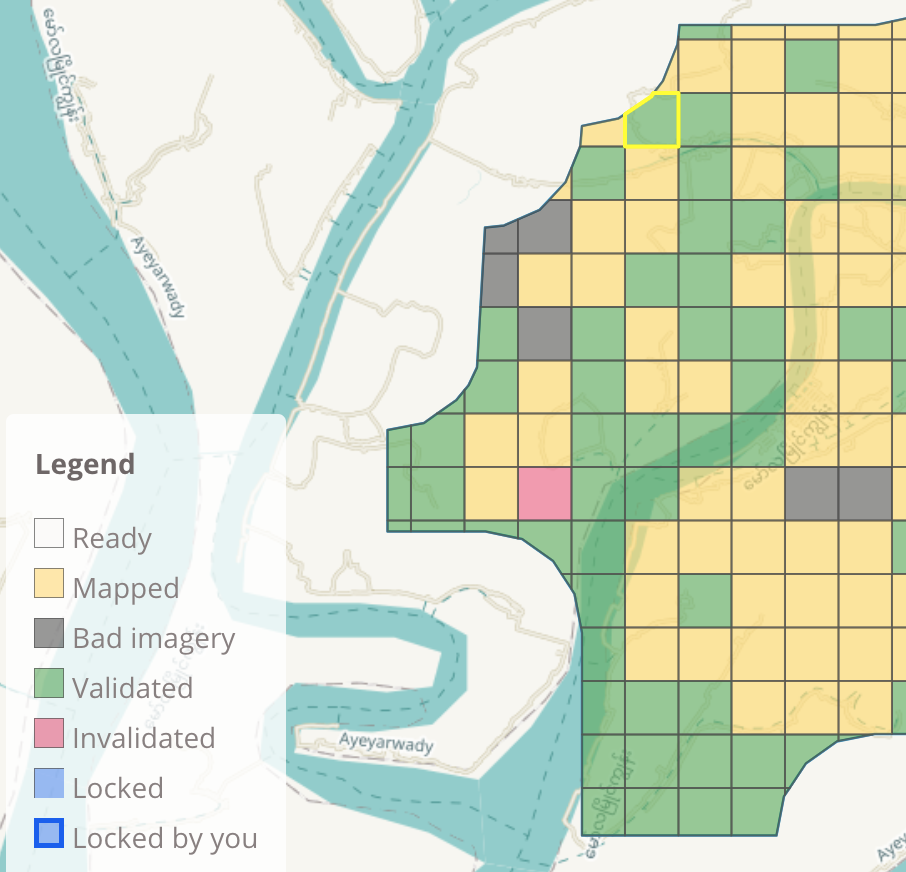
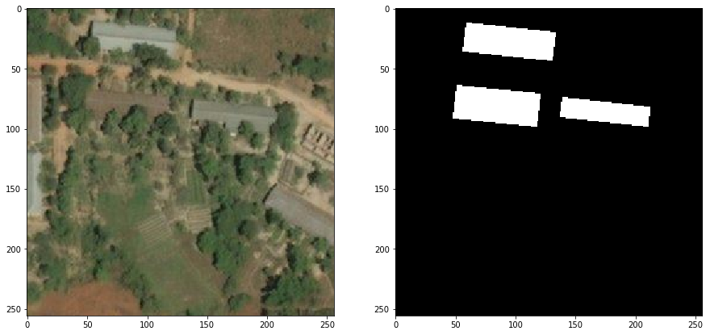

# Machine Tagging of Building Geometry

This contains work toward machine tagging of buildings in satellite imagery to accelerate work of the [Humanitarian OpenStreetMap Team](https://tasks.hotosm.org).  First we will compile a data set suitable for machine learning training, then proceed to learn.  

This takes advantage of verified tasks in the HOTOSM project. First, a volunteer tag buildings within a given task area. Second, an experienced volunteer verifies their work.  Once done, tasks are marked as verified.  This gives us an excellent source of truth with which to do some machine learning.  Below is an example of a task grid, with tasks in varying states of completeness:

Once we have verified tasks we can collect building geometry and map tiles.  This involves pulling buildings from OSM and map tiles from Bing.  Below shows a completed state where we have a vanilla map tile (our input) and a tile with labelled buildings in white (our truth).  Together these form the training data for our machine learning pipeline:

## Applications

There are two directions I could see this going in:

1. AI plays the role of the first volunteer, tagging large areas on the map to be later verified by humans.
1. Used for high-level planning, or as a first line of information in cases of sudden need.  Imagine the need arises in an as-yet unmapped area.  Models should give good direction to humans at a high-level, for example, estimating centres of population quickly across large geographies.  Here a reasonably accurate locator of buildings would be valuable, even if it cannot accurately trace building polygons.

# Current Status

Data has been collected for the Ayeyarwady Delta region and pre-processed into input/output pairs.   The input is a plain satellite map tile and the output is a black and white images where white pixels indicate the presence of a building. 

This amounts to 121,078 map tiles, plus a corresponding b&w truth image for each.  Note here that our ~500,000 buildings are present in only ~1/5 of map tiles collected.  We'll need to consider this later we will currently ignore all map tiles that don't contain a building, which will likely bias our learner to be over-eager at finding buildings.

## Collected Data to Date

With a focus on the Ayeyarwady Delta region, we have collected:

* 40 project areas
* 14,292 verified task areas
* 545,139 verified building polygons
* 561,310 (or 7.1GB) corresponding map tiles
* 121,078 map tiles that entirely contain buildings + 121,078 corresponding "truth" images

# Building the Training Set

We began by compiling a set of training data, along with tools to reproduce this later, or extend for future uses.  The following pages give background on how we collected data from three sources (OSM, HOTOSM, Bing) in order to generate a set of map tiles with corresponding verified building polygons.  

1. [Enumerate Projects of Interest](../../wiki/Enumerating-Projects)
1. [Locate Validated Task Areas](../../wiki/Finding-Validated-Task-Areas)
1. [Query Area for Building Polygons](../../wiki/Find-Building-Polygons-using-the-Overpass-API)
1. [Fetch Map Tiles & Match to Buildings](../../wiki/Find-Map-Tiles-&-Computing-Coordinates)
1. [Generate Image Pairs Suitable for ML](../../wiki/Generate-Image-Pairs-Suitable-for-ML)

[Scripts and Code](../../wiki/Data-Collection-Scripts) gives detail on how to set up your environment and then run this data collection process.

In addition you can check out the following Jupyter notebooks for some exploratory work:

1. [Computing Pixel Coordinates to Display Buildings on Map Tiles](scripts/map_tile_truth_preparation.ipynb)

# Machine Learning: Model Training and Deployment

For now I've written very high level notes on [Model Training](../../wiki/Notes-on-Model-Training) and [Deployment Options](../../wiki/Deployment-Options).

I'm also keeping a [Reading List](../../wiki/Reading-List).

# Next Steps

- [ ] Modify existing TensorFlow models to run on our training data. See what happens.
- [ ] Improve training data:
  - [ ] Handle buildings that cross map tiles
  - [ ] Include map tiles that contain zero buildings

